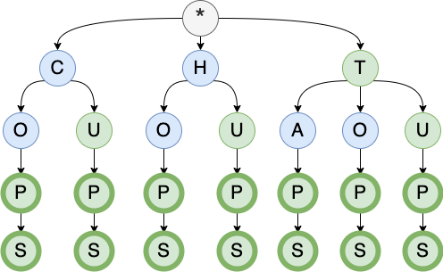
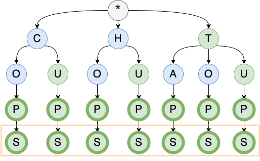
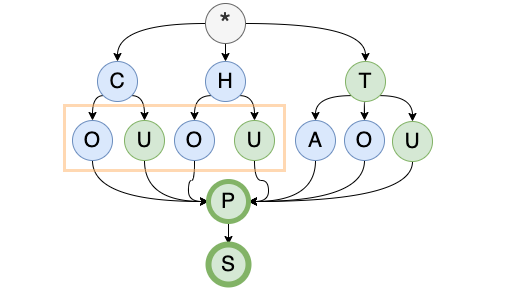
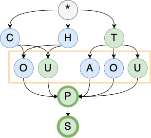
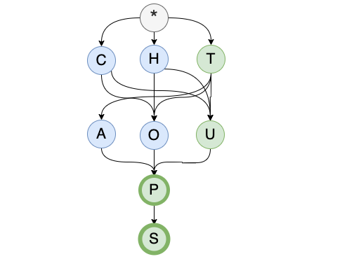
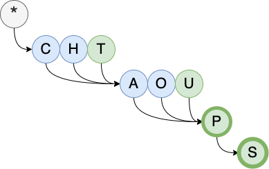
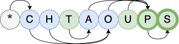
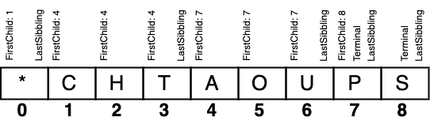

# Overview
## What is a DAWG/DAFSA?
[A DAWG (Directed Acyclic Word Graph), also known as DAFSA (Deterministic Acyclic Finite State Automaton) ](https://en.wikipedia.org/wiki/Deterministic_acyclic_finite_state_automaton) is an interesting graph data structure used for storing strings with a minimal memory usage while maintaining very good query time for both search and prefix search. In the same way that the Trie data structure merges common prefixes, in a DAWG common suffixes are also merged. 

A DAWG can be represented in a [compact way as a sequence of values (usually 4 bytes values)](https://pages.pathcom.com/~vadco/dawg.html), being its size in disk almost the same as its size in memory. The size of a DAWG depends on the amount of common prefixes and suffixes that a list of words have, so the DAWG may or may not outperform GZIP in the compression rate. For example in my implementation the [2019 Collin's Scrabble wordlist](https://boardgames.stackexchange.com/questions/38366/latest-collins-scrabble-words-list-in-text-file) with 279,496 words and a file size of 4,123 kB results in DAWG of 712 kB, while GZIP produces a 706 kB file; but the [Polish Scrabble wordlist](http://sjp.pl/slownik/growy/) with 3,043,375 words and a file size of 38,827 kB results in a DAWG of 1,575 kB, while GZIP produces a 7,720 kB file.

Nevertheless, when reducing a Trie into a DAWG if all common suffixes are merged it may lead to a graph that has a reduced numbe of nodes, but that cannot be represented as a sequence of values, and therefore would take more space. Testing against other DAWG library I could se that for the same file the Trie was reduced to the half of the nodes of my implementation and was around 25-30% faster, but outputs a DAWG file that is 25-30% bigger than from my implementation.

Building a DAWG is an expensive process since the graph needs to be analyzed and processed. GZIP can be more than 5x times faster at times. However a DAWG is queryable while a GZIP file needs to be expanded and maybe processed into another data structure (eg: a hashset). Creating a Trie, which is the first step of creating a DAWG, has a time complexity of `O(nm)`, where `n` is the number of words and `m` the average word length. Subsequent steps to build a DAWG merging common sufixes may involve multiple graph DFS passes depending on the implementation.

Queyring a DAWG has a time complexity of `O(cw)`, where `c` is the number of different characters and `w` the word to search length. In the mentioned Collin's wordlist, 26 characters and the longest word has 15 characters, making the DAWG very fast. Having the words in a hashset provides a faster query time with `O(1)` time complexity, but its size in memory would be bigger and it would not be possible to do a prefix search.

## This project

There are several algorithms to build a DAWG, some more efficient than others. For this purely self-didactic project, inspired in the idea of having a hash that represents a node and its descendency, I have developed a simple one also based on hashing that allows it not only to find nodes that are equivalent in both value and descendency, but also to quickly identify equivalent sibling lists. Hashing is fast but not bulletproof and a collision is possible, although I have tested current implementation in many files and used two different hash calculations combined, it is statistically possible. That is why I have included a method to check that the generated DAWG contains the expected words. Good news is that hashing is just used to classify nodes siblingness, and once the DAWG is built is not necessary anymore. In other words, once the DAWG is created there is no need to worry about collisions, and if you get a collision when building it you may need to salt a little bit the hashing algorithm.

This is a **proof of concept** and should not use in production unless you know what you are doing. However if you use it and get into a wordlist that fails during DAWG validation... let me know, I will be definitely curious :)

# Using the library

If you want to give it a try, you can either use it as a library in an application, or install it directly from Nuget as a console tool.

## Console tool
If you have dotnet 3.1 installed, you can install the tool directly from [Nuget](https://www.nuget.org/packages/vtortola.Dawg.Tool/0.0.1-alpha)

### Install the tool

```
$ dotnet tool install --global vtortola.Dawg.Tool --version 0.0.1-alpha
You can invoke the tool using the following command: dawg
Tool 'vtortola.dawg.tool' (version '0.0.1-alpha') was successfully installed.
```

### Creating a DAWG from a wordlist file

To build a DAWG file from a wordlist just pipe the lines through it with the subcommand `build` and redirect it to the desired file.

```
$ cat espanol.txt | dawg build > espanol.dawg

$ ls -lh espanol*
-rw-r--r--  1 vtortola  users   169K Sep  5 18:39 espanol.dawg
-rw-r--r--  1 vtortola  users   1.9M Aug  1 01:45 espanol.txt
```

### Creating a wordlist from a DAWG file

To obtain the wordlist from the DAWG file, just pipe the content through the tool with the `unbuild` command and redirect to a file.

```
$ cat espanol.dawg | dawg unbuild > espanol.copy.txt
```

However keep in mind that the DAWG does not contain empty lines or duplicated words, and the order may be different than in the original wordlist. This specific source wordlist file `espanol.txt` contains some words that are repeated, so the correct way of matching its content against the wordlist generated from a DAWG file would be to also remove duplications from the source.

```
$ cat espanol.txt | wc -l
  174848

$ cat espanol.txt.copy | wc -l
  168505
```

```
$ cat espanol.txt | grep -v ^\s*$ | sort | uniq | wc -l
  168505

$ cat espanol.txt.copy | grep -v ^\s*$ | sort | uniq | wc -l
  168505
```


## Library
You can use it from [Nuget](https://www.nuget.org/packages/vtortola.Dawg/0.0.1-alpha)

* Static:
  - `Dawg.Create(...)`: builds a `Dawg` object from a list of strings.
  - `Dawg.Verify(...)`: checks that all the words in a list of strings are contained in the `Dawg`.
  - `Dawg.Read(...)`: deserializes a `Dawg`.
  - `Dawg.Write(...)`: serializes a `Dawg`.
  
* Instance
  - `Dawg.Contains(string word)`: checks if a word exists in the `Dawg` instance.
  - `Dawg.WithPrefix(string prefix)`: enumerates words that start with the given prefix in the `Dawg`.

# Building a memory optimized DAWG

Let's build a DAWG with the following words: `COP, COPS, CUP, CUPS, HOP, HOPS, HUP, HUPS, TAP, TAPS, TOP, TOPS, TUP, TUPS`.

## The Trie

The first step is to build a Trie. I created some pictures to illustrate the process:

* The gray node is the root and has no meaning beyond being the common parent for all the first letters. 
* Nodes with a bold circunferene are **terminal nodes**, meaning that a word exists in that location. 
* Green nodes are the **last node** in a list of sibblings, something we will need to know when building the final representation of the DAWG. 
* The orange rectangle points to where the next step is gonna happen.



## Hashing nodes

Nodes are **equivalent**, and therefore mergeable, if they have the same terminal status, equivalent siblings and equivalent descendancy. 

Performing those comparisons recursively each time is impractical, so as other DAWG algorithms my implementation relies on hashing to perform these comparisons in an efficient manner. 
For each node, multiple hashes are calculated: 
 * A tuple with two hashes that represent the node value and its descendency. Both hashes use the node value, children count, distance to further leaf and its descendency accumulated hash, but they are calculated in different ways to minimize the chance of a collision. Both hashing algorithms were able to process all my test files when used in isolation, so the combination of both should work best.
 * A hash per possible sibbling list suffix. For a list of nodes ABC, hashes are generated for ABC, BC and C. Therefore if there s a list BC that is equivalent, ABC could be reused starting at index 1.

Also during this step, a cache is recording which is the bigger list that contains a specific sublist hash, so bigger lists can be reused to represent as many smaller lists as possible.

## Merging nodes

Note this is not the actual way this implementation works. It just illustrates the type of merges that are allowed.

Starting from the bottom, parent nodes of a given node which have same destinations and brothers can be merged.

The `S` nodes can be merged.



The `P` nodes can be merged.


Equivalent sibling lists can be merged. This means that both sibling lists have the same destination and hiearchy.



When a sibbling list A has the same values and targets than a part of other sublist B, the merge is also possible, but only if A is a suffix of B. This is important because during serialization the last item of B will be marked as `LastSibling` and this must be true for A as well.



This would be the result graph after doing all the possible merges.



## Store it as an array

The final step is to use an array of 4-byte values to represent the resulting graph.

Rather than representing the children of each node as a list of nodes (or pointers to nodes), we can have for each node a single pointer indicating which is the first child, and all the nodes following the first child are considered siblings until the last one is detected. 



Then it is possible to represent the nodes as a sequence, where each node can have only a reference to another single node, and still be able to represent the graph.



To store each node as 4 byte value, the 32 bits are distributed as follows:

 - 8 bits for the value: 256 different symbols can be used in the DAWG.
 - 22 bits for the first child reference: 4,194,304 nodes can be stored in the DAWG.
 - 1 bit to indicate if the node is terminal.
 - 1 bit to indicate if the node is the last sibling.



## The algorithm

The basic steps of this implementation are:
 * Build a trie.
 * Do bottom-up DFS generating all the hashes.
 * Remember the longest sibling list for each siblings hash.
 * Sort in descending order the list of longest sibling lists and number the nodes sequentially. Enqueue the nodes of these lists.
 * Write in the DAWG the children of the start node (which are indeed the first letters of every word in the source wordlist).
 * Write all the nodes in the queue to the DAWG using the provided number as array index.
 
### What is good about it?

It is fast and the compression ratio is very good.

### What is not good about it?

Relies only in hashing. A hash collision would produce an inconsistent DAWG. That is why a `Dawg.Verify` method is provided to detect an inconsistent DAWG.

To go through the DAWG requires to jump back and forward in the array, in order words, a child node may have a smaller array index than a parent, making it more difficult to detect a loop. An inconsistent DAWG may fall into a endless loop.

# Comparisons

These are some comparative tests I have performed to understand the behaviour of a DAWG. These tests are not benchmarks and are not mean to be accurate, their purpose is just to get an idea on how a DAWG comparares to other data structures in both size and performance.

## File size

It seems that as expected the size of the DAWG depends heavily on the similarities between the words in the wordlist. Although usually GZIP seems to provide a better compression rate, for example in `francais.txt` the DAWG file size is less than the half of the GZIPed file size.

| File Name | File Size | Words | DAWG<br/>Build time | DAWG<br/>File Size | GZIP<br/>Time | GZIP<br/>File Size |
| :-- | --: | --: | --: | --: | --: | --: |
|1000common.txt|6 kB|1,000|34 ms|6 kB|3 ms|2 kB|
|collins_scrabble_2015.txt|2,727 kB|276,643|687 ms|706 kB|163 ms|698 kB|
|collins_scrabble_2019.txt|2,758 kB|279,496|542 ms|711 kB|163 ms|706 kB|
|corncob_caps.txt|529 kB|58,109|126 ms|210 kB|39 ms|156 kB|
|dansk.txt|225 kB|23,436|64 ms|127 kB|17 ms|70 kB|
|deutsch.txt|1,995 kB|165,770|380 ms|549 kB|112 ms|474 kB|
|english3.txt|1,863 kB|194,433|394 ms|596 kB|119 ms|510 kB|
|espanol.txt|1,968 kB|168,506|238 ms|169 kB|101 ms|402 kB|
|francais.txt|2,202 kB|208,345|273 ms|200 kB|132 ms|485 kB|
|german.dic|33,323 kB|2,055,775|7,770 ms|4,914 kB|1,151 ms|6,240 kB|
|nederlands3.txt|1,940 kB|180,128|400 ms|584 kB|118 ms|508 kB|
|pl.dic|3,834 kB|292,248|888 ms|997 kB|173 ms|931 kB|
|pt-BR.dic|3,984 kB|301,530|1,159 ms|1,546 kB|189 ms|1,084 kB|
|slowa.txt|38,827 kB|3,043,375|5,345 ms|1,575 kB|1,654 ms|7,720 kB|
|sowpods.txt|2,905 kB|267,752|473 ms|689 kB|147 ms|685 kB|
|swiss.txt|1,995 kB|165,593|374 ms|549 kB|114 ms|473 kB|
|wlist_match1.txt|13,944 kB|1,516,999|4,999 ms|5,711 kB|789 ms|4,303 kB|
|wordlist-fr.txt|3,603 kB|320,848|440 ms|287 kB|227 ms|948 kB|
|words_alpha.txt|3,774 kB|370,104|975 ms|1,389 kB|220 ms|1,060 kB|
|words.txt|4,749 kB|466,547|1,358 ms|1,841 kB|274 ms|1,433 kB|

## Estimated Memory usage

It is hard to get how much memory an object is using, so I am serializing the object in binary and using that as estimation.
The DAWG shows better memory usage than `Hashset<string>` and `string[]`, but the ratio varies depending on the file.

| File Name | Words | DAWG<br/>≈ Memory Usage | HashSet<string><br/>≈ Memory Usage | string[]<br/>≈ Memory Usage |
| :-- | --: | --: | --: | --: |
|1000common.txt|1,000|6 kB|11 kB|11 kB|
|collins_scrabble_2015.txt|276,643|706 kB|4,079 kB|4,078 kB|
|collins_scrabble_2019.txt|279,496|711 kB|4,123 kB|4,122 kB|
|corncob_caps.txt|58,109|210 kB|814 kB|813 kB|
|dansk.txt|23,436|127 kB|350 kB|349 kB|
|deutsch.txt|165,770|549 kB|2,877 kB|2,877 kB|
|english3.txt|194,433|596 kB|2,813 kB|2,812 kB|
|espanol.txt|168,506|169 kB|2,720 kB|2,720 kB|
|francais.txt|208,345|200 kB|3,409 kB|3,408 kB|
|german.dic|2,055,775|4,914 kB|42,328 kB|42,328 kB|
|nederlands3.txt|180,128|584 kB|2,824 kB|2,823 kB|
|pl.dic|292,248|997 kB|5,165 kB|5,164 kB|
|pt-BR.dic|301,530|1,546 kB|5,135 kB|5,135 kB|
|slowa.txt|3,043,375|1,575 kB|53,688 kB|53,687 kB|
|sowpods.txt|267,752|689 kB|3,951 kB|3,950 kB|
|swiss.txt|165,593|549 kB|2,872 kB|2,871 kB|
|wlist_match1.txt|1,516,999|5,711 kB|21,351 kB|21,351 kB|
|wordlist-fr.txt|320,848|287 kB|5,055 kB|5,054 kB|
|words_alpha.txt|370,104|1,389 kB|5,581 kB|5,581 kB|
|words.txt|466,547|1,841 kB|7,027 kB|7,027 kB|

## Search Time

The search test is taking 20 words randomly and searching for them 100 times each.

For the binary search I used [Array.BinarySearch](//docs.microsoft.com/en-us/dotnet/api/system.array.binarysearch)

| File Name | Words | DAWG<br/>Search | HashSet<string><br/>Search | string[]<br/>Linear Search | string[]<br/>Binary Search |
| :-- | --: | --: | --: | --: | --: |
|1000common.txt|1,000|2 ms|1 ms|10 ms|1 ms|
|collins_scrabble_2015.txt|276,643|2 ms|0 ms|1,323 ms|1 ms|
|collins_scrabble_2019.txt|279,496|1 ms|0 ms|795 ms|1 ms|
|corncob_caps.txt|58,109|1 ms|0 ms|250 ms|0 ms|
|dansk.txt|23,436|1 ms|0 ms|106 ms|0 ms|
|deutsch.txt|165,770|2 ms|0 ms|649 ms|1 ms|
|english3.txt|194,433|2 ms|0 ms|939 ms|1 ms|
|espanol.txt|168,506|2 ms|0 ms|906 ms|1 ms|
|francais.txt|208,345|1 ms|0 ms|827 ms|0 ms|
|german.dic|2,055,775|3 ms|0 ms|11,521 ms|1 ms|
|nederlands3.txt|180,128|2 ms|0 ms|751 ms|1 ms|
|pl.dic|292,248|2 ms|0 ms|1,658 ms|1 ms|
|pt-BR.dic|301,530|2 ms|0 ms|1,860 ms|0 ms|
|slowa.txt|3,043,375|2 ms|0 ms|18,505 ms|1 ms|
|sowpods.txt|267,752|2 ms|0 ms|1,235 ms|1 ms|
|swiss.txt|165,593|2 ms|0 ms|874 ms|1 ms|
|wlist_match1.txt|1,516,999|3 ms|0 ms|8,626 ms|1 ms|
|wordlist-fr.txt|320,848|2 ms|0 ms|1,288 ms|1 ms|
|words_alpha.txt|370,104|2 ms|0 ms|1,453 ms|1 ms|
|words.txt|466,547|3 ms|0 ms|2,765 ms|1 ms|
 
 ## Prefix Search Time

To asset the performance of the prefix search correctly, prefix length, average word length and number of desired words should be considered as variables.

The DAWG has an important handicap here. The words do not exist as strings inside the DAWG, they are constructed during the traversal of the graph using a `StringBuilder` each time. This fact impacts performance and is more prominent when a bigger amount of words are generated from the DAWG.

The prefix test is taking the 20 most common prefixes and doing a prefix search 100 times each. One test is just taking the first 50 words with the desired prefix, and the other is taking the first 500 words.
 
### Top 50 prefixes 
| File Name | Words | Top50 Prefix <br/>DAWG Search | Top50 Prefix<br/>string[] Linear Search |
| :-- | --: | --: | --: |
|1000common.txt|1,000|10 ms|21 ms|
|collins_scrabble_2015.txt|276,643|48 ms|1,313 ms|
|collins_scrabble_2019.txt|279,496|43 ms|1,356 ms|
|corncob_caps.txt|58,109|41 ms|261 ms|
|dansk.txt|23,436|46 ms|105 ms|
|deutsch.txt|165,770|82 ms|932 ms|
|english3.txt|194,433|46 ms|943 ms|
|espanol.txt|168,506|103 ms|742 ms|
|francais.txt|208,345|35 ms|747 ms|
|german.dic|2,055,775|42 ms|15,499 ms|
|nederlands3.txt|180,128|40 ms|1,000 ms|
|pl.dic|292,248|71 ms|1,713 ms|
|pt-BR.dic|301,530|239 ms|1,845 ms|
|slowa.txt|3,043,375|34 ms|18,281 ms|
|sowpods.txt|267,752|49 ms|1,319 ms|
|swiss.txt|165,593|38 ms|974 ms|
|wlist_match1.txt|1,516,999|52 ms|9,571 ms|
|wordlist-fr.txt|320,848|54 ms|1,423 ms|
|words_alpha.txt|370,104|58 ms|2,684 ms|
|words.txt|466,547|77 ms|3,898 ms|

### Top 500 prefixes
| File Name | Words | Top500 Prefix <br/>DAWG Search | Top500 Prefix<br/>string[] Linear Search |
| :-- | --: | --: | --: |
|1000common.txt|1,000|7 ms|21 ms|
|collins_scrabble_2015.txt|276,643|449 ms|2,266 ms|
|collins_scrabble_2019.txt|279,496|437 ms|2,209 ms|
|corncob_caps.txt|58,109|136 ms|569 ms|
|dansk.txt|23,436|86 ms|246 ms|
|deutsch.txt|165,770|404 ms|979 ms|
|english3.txt|194,433|364 ms|1,962 ms|
|espanol.txt|168,506|393 ms|795 ms|
|francais.txt|208,345|376 ms|1,238 ms|
|german.dic|2,055,775|516 ms|15,659 ms|
|nederlands3.txt|180,128|502 ms|1,206 ms|
|pl.dic|292,248|836 ms|1,791 ms|
|pt-BR.dic|301,530|732 ms|1,867 ms|
|slowa.txt|3,043,375|451 ms|18,506 ms|
|sowpods.txt|267,752|430 ms|2,138 ms|
|swiss.txt|165,593|434 ms|1,036 ms|
|wlist_match1.txt|1,516,999|576 ms|9,769 ms|
|wordlist-fr.txt|320,848|457 ms|1,478 ms|
|words_alpha.txt|370,104|753 ms|2,775 ms|
|words.txt|466,547|694 ms|4,238 ms|

# Bibliography

 * http://www.wutka.com/dawg.html
 * https://pages.pathcom.com/~vadco/dawg.html
 * https://github.com/chalup/dawggenerator
 * http://porcupineprogrammer.blogspot.com/2012/03/dawg-data-structure-in-word-judge.html
 * https://www.aclweb.org/anthology/J00-1002/
 * http://stevehanov.ca/blog/?id=115
